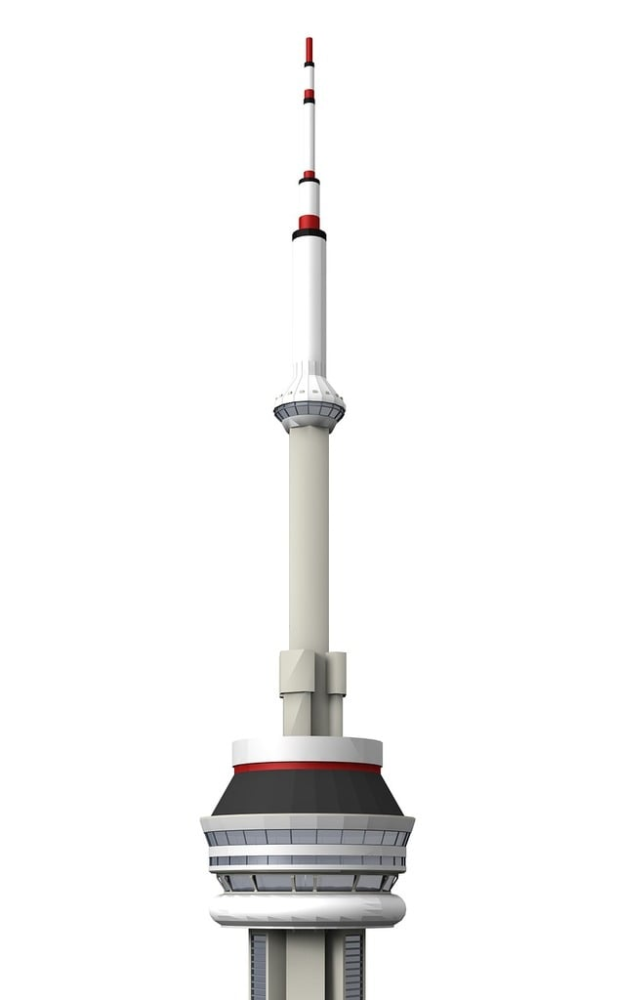

# 6ixCast 

Code for the U of T Physics contribution to the ECMWF AI Weather Quest. 

## Directory structure

- **data** directory 
    - download_scripts: currently just for the postprocessed ERA5 data shared for the AI-WQ
    - sub-directories have the structure data/\<dataset\>/\<variable\>
